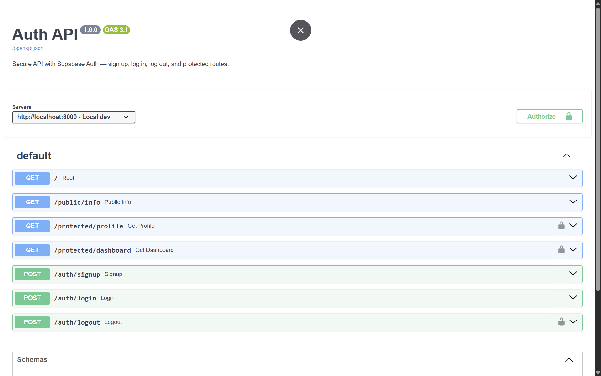

# Auth API — Supabase JWT Authentication

A secure FastAPI backend that handles user authentication (Sign Up, Log In, Log Out) and protects specific routes using Supabase Auth and JSON Web Tokens (JWTs).

Built for the FlyRank Backend AI Engineering track (BE-03).

## Features

- User registration and login via Supabase Auth
- JWT-based access tokens for authenticated requests
- Reusable auth middleware protecting multiple routes
- Automatic OpenAPI / Swagger UI at `/docs` with Bearer token authorization
- Proper HTTP status codes: 201, 200, 204, 400, 401

## Tech Stack

- **Framework:** FastAPI (Python)
- **Auth Provider:** Supabase Auth
- **SDK:** supabase-py

## Quick Start

### Prerequisites

- Python 3.10+
- A Supabase account (free at [supabase.com](https://supabase.com))

### Setup

1. Clone the repo and enter the directory:

```bash
git clone <your-repo-url>
cd be03-auth-api
```

2. Create a virtual environment and install dependencies:

```bash
python -m venv venv
source venv/bin/activate  # Windows: venv\Scripts\activate
pip install -r requirements.txt
```

3. Create a `.env` file from the template:

```bash
cp .env.example .env
```

4. Fill in your Supabase credentials:
   - Go to your [Supabase Dashboard](https://supabase.com/dashboard)
   - Open **Project Settings → API**
   - Copy your **Project URL** and **anon key**
   - Paste them into `.env`:

```
SUPABASE_URL=https://your-project-id.supabase.co
SUPABASE_KEY=your-anon-key-here
```

5. (Recommended) Disable email confirmation for testing:
   - Supabase Dashboard → Authentication → Providers → Email
   - Turn off **Confirm email**

6. Start the server:

```bash
uvicorn main:app --reload
```

7. Visit [http://localhost:8000/docs](http://localhost:8000/docs) for interactive Swagger UI.

### Testing with curl

```bash
# Public route — no auth required
curl -i http://localhost:8000/public/info

# Sign up a new user
curl -i -X POST http://localhost:8000/auth/signup \
  -H "Content-Type: application/json" \
  -d '{"email":"test@example.com","password":"password123"}'

# Log in and receive tokens
curl -i -X POST http://localhost:8000/auth/login \
  -H "Content-Type: application/json" \
  -d '{"email":"test@example.com","password":"password123"}'

# Use the access_token from login to access protected routes
curl -i http://localhost:8000/protected/profile \
  -H "Authorization: Bearer <your-access-token>"

# Log out
curl -i -X POST http://localhost:8000/auth/logout \
  -H "Authorization: Bearer <your-access-token>"
```

## API Reference

| Method | Endpoint                | Auth Required | Status Codes         | Description                         |
|--------|-------------------------|---------------|----------------------|-------------------------------------|
| GET    | `/public/info`          | No            | 200                  | Public info — no token needed       |
| POST   | `/auth/signup`          | No            | 201, 400             | Register a new user account         |
| POST   | `/auth/login`           | No            | 200, 400, 401        | Authenticate and receive JWT        |
| POST   | `/auth/logout`          | Yes           | 204, 401             | End the current session             |
| GET    | `/protected/profile`    | Yes           | 200, 401             | Get authenticated user's profile    |
| GET    | `/protected/dashboard`  | Yes           | 200, 401             | Example protected dashboard route   |

### Status Code Meanings

| Code | Meaning                                |
|------|----------------------------------------|
| 200  | Success                                |
| 201  | Created (signup)                       |
| 204  | No Content (logout)                    |
| 400  | Bad Request — missing or invalid input |
| 401  | Unauthorized — missing/bad/expired token |

## Screenshots



## Project Structure

```
be03-auth-api/
├── main.py          # FastAPI app with all routes
├── auth.py          # Supabase client + auth dependency
├── .env.example     # Environment variable template
├── .gitignore       # Prevents .env from being committed
├── requirements.txt # Python dependencies
└── README.md        # This file
```

## Security Notes

- **Never commit `.env`** — It contains your Supabase keys.
- The **anon key** is safe for client-side use; never use the `service_role` key in a client context.
- All passwords are handled by Supabase — your code never stores or hashes them.
- Access tokens expire after 1 hour (Supabase default); use the refresh token to get new ones.
